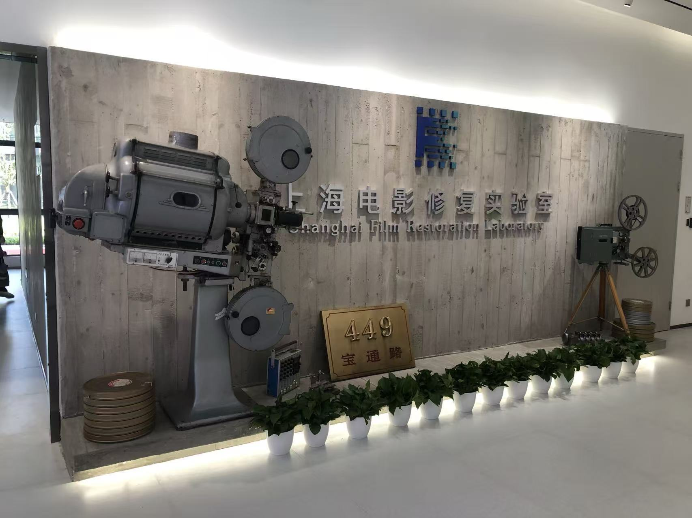
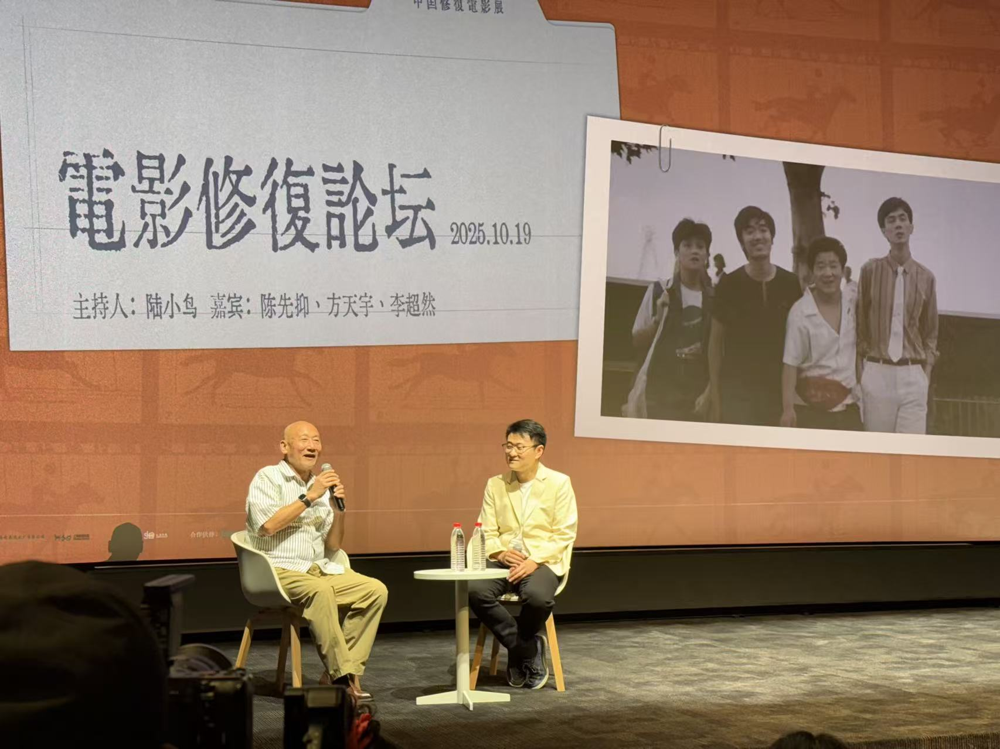
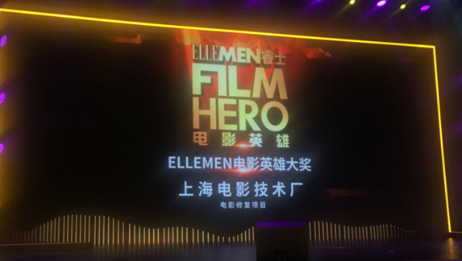

## Hi there 👋

I am Tiany(Junjie) Yuan, an film engineer working on Film Restoration, Movie Production, \etc. 

## Work Experience

- principal of Shanghai Film Restoration Lab, SFTP(Shanghai Film Restoration Plant).	2010.7 - Present

## About Our Restoration Lab

### Interesting Works

- Our Restoration Lab Blog:

  -  https://mp.weixin.qq.com/s/6y4-Q8A_oegKZtGDIMywwQ
  -  https://mp.weixin.qq.com/s/OskQoOsc3MIgCzWAfQKw5w

- Corporation with Tongji University for developing Film Restoratiion Models

- 2025年陆续完成《阿诗玛》、《一江春水向东流》、《理发师》、《海上旧梦》、《八千里路云和月》等影片的4K精致修复。

  - 4K "AShiMa" restored by Our Team https://mp.weixin.qq.com/s/gxf_Bj7Q3Ivn0qK9iKQnQg

- 2014 年、2016 年、2017 年，持续推进《上海经典影片数字化转换及应用推广》项目，完成90 部上影厂故事片数字化修复。

  2024 年，完成上影 IP 数字化（含胶片抢救）项目，实现20 部经典影片 4K 修复、140 部 DCP 母版制作、736 本胶片数字化。

- 2013—2019 年，实施《上海电影影片资料抢救项目》，完成上海电影故事片、译制片、纪录片、科教片共计12500 本胶片数字化，以及117 部故事片数字修复。

- 2013 年，成功完成上海第一部立体声影片《一夜歌星》、《女市长的私人生活》2K 精致修复；同年完成上海美术电影制片厂全部美术影片数字化及部分经典影片修复工程。

### Photo

> 上海电影技术厂 1957 年成立，是上海最早建成的专业化电影洗印基地。2008 年企业完成战略转型，形成数字制作、影院服务两大核心产业：数字制作中心承接国内外电影、电视剧全流程后期制作，以及胶片数字化、影片修复等业务；上海上影影视科技发展有限公司专注提供影院 + 跨界集成解决方案，致力于为观众呈现真实优质的观影体验。

Film Restoration Forum host by our company. The photo depicts me interviewing an elder Shanghai Director

## Honor

- 影片《阿诗玛》4K精致修复，入围西班牙圣塞巴斯蒂安国际电影节、法国里昂卢米埃尔电影节影片4K修复单元
- 上海电影技术厂影修复团队，获得睿士“电影英雄”电影修复项目奖

## Contact

- SFTP Official: sftp_yuanjunjie@outlook.com

Our Company Official website: 
[https://www.sh-sfc.com/col3/index.html](https://www.sh-sfc.com/col3/index.html) 

https://www.sfp-hope.com/

